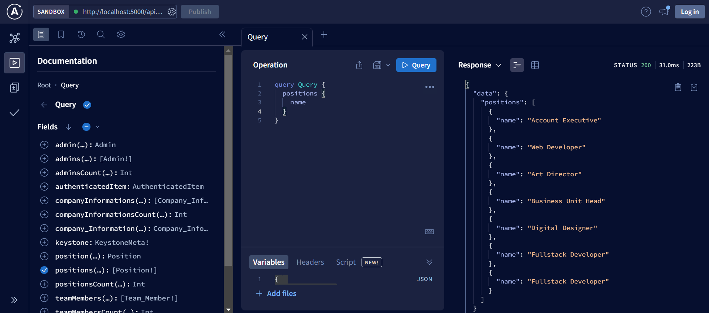

## KeystoneJS 6 API

KeystoneJS 6 menggunakan `GraphQL API` bukan RESTful API, keduanya berbeda dalam mendesain dan mengakses API (Application Programming Interface) untuk mengakses dan mengelola data dari server. Pada GraphQL kita bisa menulis query untuk get data pada sisi frontend maupun backend

### GraphQL API

Endpoint untuk mengakses API dan apollo server pada **Keystone 6**

```
localhost:8000/api/graphql
```
Lalu untuk mengakses data nya kita perlu menulis query **GraphQL**

```
// Contoh query untuk get data email dari table teamMembers

query {
  teamMembers {
    email
  }
}
```

**Full Documentation GraphQL Query**

https://keystonejs.com/docs/graphql/overview

Get Data pada Apollo Server (Backend)

Buka Apollo Server http://localhost:5000/api/graphql



Get Data pada Next JS (Frontend)

```
import axies from 'axios';

const API_URL = 'http://localhost:5608/api/graphgl’;

export async function getServerSideProps() {
  const query = `
    query {
      teamMembers {
        email
      }
    }
  `;

  const res = await axios.post(API_URL, {
    query,
  });

  const data = await res.data.data;

  return {
    props: {
      teamMemberData: data,
    },
  }

export default function Home({teamMemberData}) {
  const email = teamMemberData.teamMembers;
}

```


### RESTful API

Pada RESTful API, setiap endpoin (URL) mewakili satu sumber (resource) yang berbeda. Untuk mengakses data, klien mengirimkan permintaan HTTP (GET, POST, PUT, DELETE) ke endpoint tertentu.

Contoh API untuk mengakses data tentang buku

```
GET localhost:8000/api/books
```

Respon setelah melakukan GET ke endpoint ini mungkin akan berisi daftar buku dalam format JSON.

```
[
  {
    "id": 1,
    "title": "Pride and Prejudice",
  },
  {
    "id": 2,
    "title": "To Kill a Mockingbird",
  },
  // Data buku lainnya
]
```