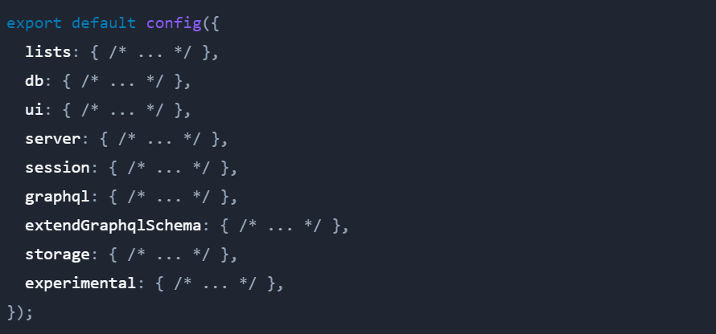

# KeystoneJS 6 Configuration

Konfigurasi berada pada file **keystone.ts** dengan ekspor default yang dikembalikan dari fungsi config(). List konfigurasi:

### Lists

Opsi konfigurasi 'lists' adalah tempat di mana kita mendefinisikan model data atau skema dari sistem Keystone. Pada KeystoneJS 6 berada pada file **Schema.ts**.

### Database

[Database Pada KeystoneJS 6](./Database.md.md)

