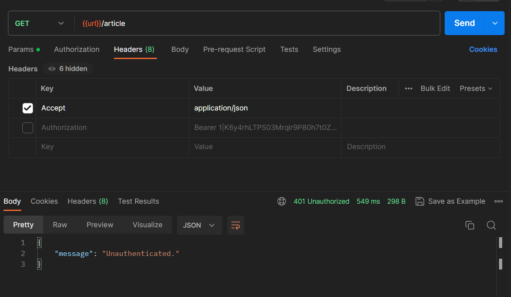

## Authentication (Otentikasi)

Otentikasi adalah proses verifikasi identitas pengguna atau sistem. Misalnya, saat kita masuk ke akun email kita dengan memberikan kombinasi nama pengguna (atau alamat email) dan kata sandi, sistem akan mengotentikasi Anda dengan membandingkan informasi yang kita berikan dengan yang tersimpan dalam basis data. Jika informasi cocok, kita dianggap terotentikasi dan diberikan akses ke akun kita.

Pada laravel ada 2 cara untuk authentication keamanan

passport

sanctum

Kedua nya akan menghasil kan sebuah token, token akan didapat kalau user berhasil login, lalu token itu digunakan untuk cek user sudah login atau belum, user boleh akses page A atau tidak.

```
Route::get('/article', [ArticleController::class, 'index'])->middleware(['auth:sanctum']);
```

Sebelum semua data berhasil di get, `->middleware(['auth:sanctum'])` sanctum akan memeriksa user sudah login atau belum. Jika belum login maka data tidak berhasil di ambil, karena tidak terotentikasi.



Jika user belum login dan mencoba get data, akan muncul pesan **Unauthenticated**

## Authorization (Otorisasi)

Otorisasi berfungsi untuk mengontrol akses pengguna yang sudah terotentikasi terhadap sumber daya atau fitur tertentu dalam sistem. Sebagai contoh, dalam aplikasi media sosial, kita mungkin memiliki izin untuk mengedit atau menghapus kiriman kita sendiri, tetapi tidak memiliki izin untuk mengedit atau menghapus kiriman pengguna lain.