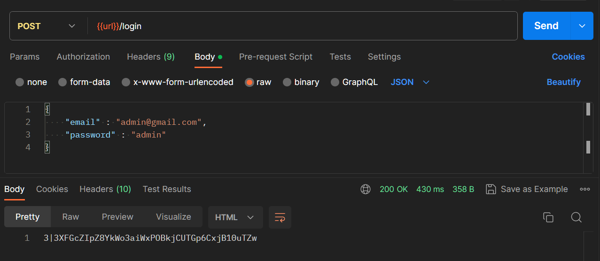
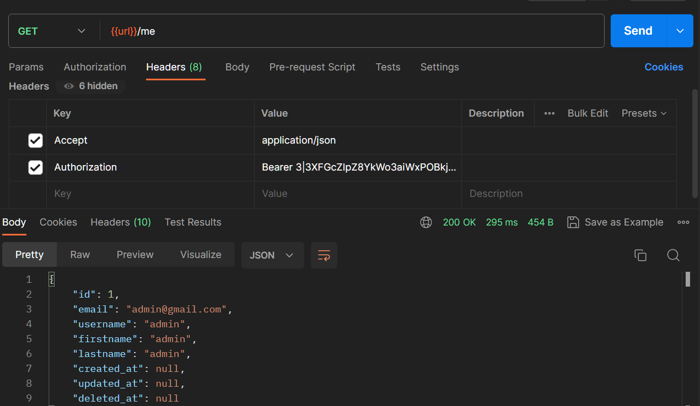
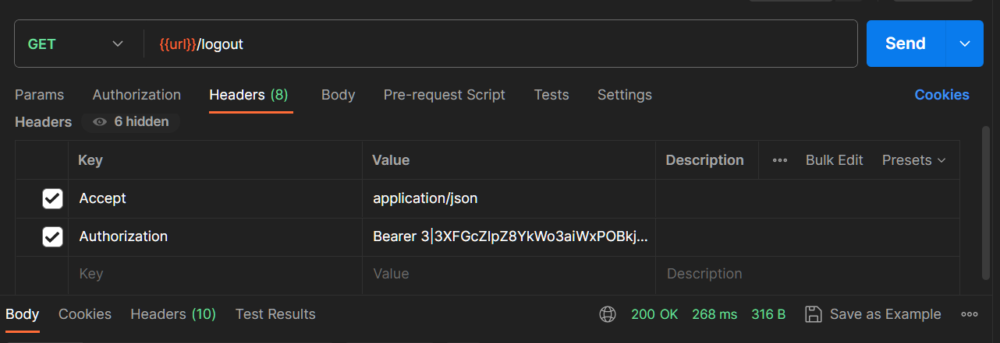

## Login
Membuat routes untuk login, dengan AuthenticationController function login.

```
Route::post('/login', [AuthenticationController::class, 'login']);
```

Membuat controller login: 
- Controller login memiliki validate() untuk validasi
- Variable user untuk mencari pengguna berdasarkan alamat email yang diberikan pada tampilan login page akan masuk kedalam permintaan (request).
- Lalu terdapat juga kondisi untuk mengecek apakah variable user ada isinya atau tidak, jika tidak akan muncul pesan, dan jika benar akan membuat token lalu mereturn nya.
- Lalu ketika user berhasil login akan mereturn sebuah token untuk proses authorization.

```
public function login(Request $request) {
    $request->validate([
        'email' => 'required|email',
        'password' => 'required',
    ]);    

    $user = User::where('email', $request->email)->first();

    if (! $user || ! Hash::check($request->password, $user->password)) {
        throw ValidationException::withMessages([
            'email' => ['The provided credentials are incorrect.'],
        ]);
    }

    return $user->createToken("User Login!")->plainTextToken;
}
```

Akses endpoint untuk login, serta masukin email & password pada body. Ketika login success saat di send akan muncul sebuah token pada body.



## See User Login

Membuat routes untuk melihat data user yang sedang login

```
Route::get('/me', [AuthenticationController::class, 'me'])->middleware(['auth:sanctum']);
```

Membuat function **me** pada controller

```
public function me() {
    return response()->json(Auth::user());
}
```
Akses endpoint untuk melihat user yang sedang login, salin token setelah login, lalu pada header masukan key `Authorization` dengan value `Bearer ...`



Header key `Accept` dengan value `application/json` berfungsi untuk memberi tahu server bahwa kita hanya ingin menerima data dalam bentuk JSON, dan bukan dalam format lain seperti XML atau HTML. Server kemudian dapat mengirimkan respons dalam format JSON agar sesuai dengan preferensi.

## Logout

Membuat routes logout, untuk user yang sudah login bisa keluar dari akun nya

```
Route::get('/logout', [AuthenticationController::class, 'logout'])->middleware(['auth:sanctum']);
```

Membuat function logout pada controller, lalu saat user berhasil logout, kita perlu menghapus token yang di dapat saat user login ke akun nya  

```
public function logout(Request $request) {
    $request->user()->currentAccessToken()->delete();
}
```

Akses endpoint untuk logout


