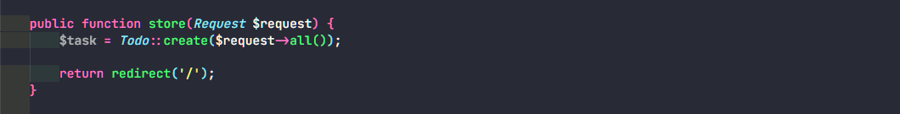

# Step for Create Data to Database

Buat tampilan form tambah data


Buat route untuk masuk ke tampilan form tambah data


Buat button tambah data, berikan route pada href ke halaman tambah data

Buat function "create" pada controller untuk return view tambah data


Buat route dengan method post, route nya sesuaikan dengan atribut action pada form


Karena menggunakan mass asignment kita perlu menulis column apa saja yang perlu diisi pada models


Terakhir buat function store untuk mengirim data ke database



**Note:**

Request pada parameter akan menangkap value apa saja yang diisi user pada input form, untuk debugging atau melihat semua value nya bisa menggunakan

```
dd($request->all());
```

Bisa juga satu value, samakan value nya sesuai atribut name pada element input html

```
dd($request->task);
```
