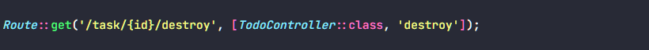
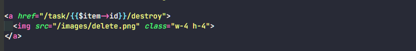
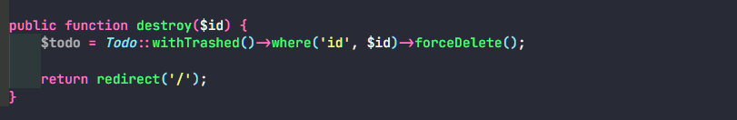

# Step for Permanently Delete / Destroy Data to Database

Buat route untuk destroy data.

Buat button untuk destroy data, tambahkan juga href nya sesuai route yang sudah dibuat.

Buat function untuk melakukan destroy. 

