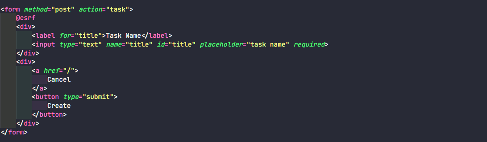

# Make Input Form HTML



**Attribute Method & Action**

- Method berfungsi untuk mengatur metode pengiriman data.
- Action berfungsi untuk mengatur URL tujuan formulir ketika di submit.

**Tag csrf**

Tag @csrf digunakan untuk melindungi aplikasi web dari serangan CSRF (Cross-Site Request Forgery). Tag @csrf akan menghasilkan input tersembunyi dengan nama _token yang berisi token CSRF.

**Tag Label**

Tag label digunakan dalam HTML untuk membuat label yang terkait dengan elemen input atau elemen form lainnya. Ketika sebuah elemen label dihubungkan dengan elemen lain menggunakan atribut for, maka ketika pengguna mengklik pada label, fokus akan beralih ke elemen terkait.

**Note:**

Pemberian nama pada atribut **for** dan **id** harus sama agar terhubung.

**Attribute Name**

Atribut name pada elemen input type="text" digunakan untuk memberikan nama atau kunci (key) kepada elemen input teks tersebut. Nama ini digunakan untuk mengidentifikasi nilai yang diisi oleh pengguna saat formulir dikirimkan ke server.

# Validation

**Required**

Atribut required pada elemen input digunakan untuk menentukan bahwa input tersebut harus diisi sebelum formulir dapat dikirimkan. 

**Email**

Elemen input dengan type="email" digunakan untuk memastikan bahwa nilai yang dimasukkan adalah alamat email yang valid. Browser akan memvalidasi input agar memenuhi format alamat email.

**Number**

Elemen input dengan type="number" digunakan untuk memastikan bahwa nilai yang dimasukkan adalah angka. Browser akan memvalidasi input agar hanya menerima input angka.

**Length**

Atribut maxlength dan minlength digunakan untuk membatasi jumlah karakter yang dapat dimasukkan ke dalam input teks.

```
<input type="text" name="username" maxlength="20" required>
```

