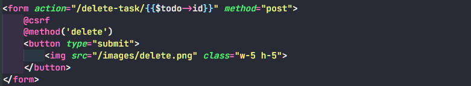
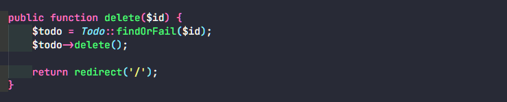
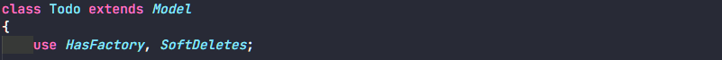

# Step for Soft Delete Data to Database

Buat route untuk soft delete data.

Buat form untuk button soft delete, pada html tidak mendukung method delete, jadi tetap menggunakan post dan menggunakan @method('delete'). Tambahkan juga action nya sesuai route yang sudah dibuat.

Buat function untuk melakukan soft delete.

**NOTED:**

Kalau ingin melakukan soft delete perlu menambahkan nya pada model

lalu perlu juga menambahkan column delete_at pada tabel dengan migration

