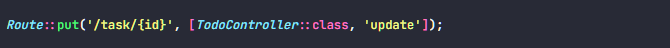

# Step for Update Data to Database

Buat route untuk masuk ke tampilan edit data

Buat button untuk masuk ke page edit data, berikan route pada href ke halaman edit data

Buat function edit, untuk return view edit dan mengoper data yang ingin di edit dengan id nya

Buat tampilan form edit data, tag form tidak mendukung method put, jadi perlu menambah kan nya dengan @method

Buat route untuk update data ketika sudah selesai diedit, dengan method put

Buat function update, variable $todo akan memilih task/data dengan id yang di sesuai

Lalu menggunakan update() untuk merubah data ke database

Variable $request->all() berisi semua data yang di input user pada form edit

