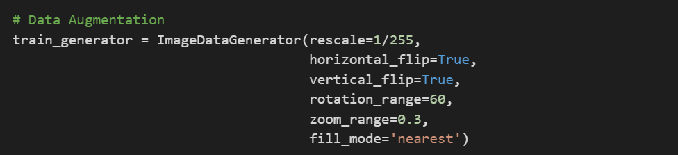

## Data Augmentation

Augmentasi Data adalah teknik membuat data baru dari data yang sudah ada dengan menerapkan beberapa transformasi seperti membalik, memutar di berbagai sudut, menggeser, memperbesar dan banyak lagi. Melatih jaringan saraf pada lebih banyak data mengarah pada pencapaian akurasi yang lebih tinggi. Dalam masalah dunia nyata, kita mungkin memiliki data yang terbatas. Oleh karena itu, augmentasi data sering digunakan untuk meningkatkan dataset kereta.

Library deep learning Keras menyediakan fungsi augmentasi data, yang menerapkan augmentasi secara otomatis saat melatih model. Fungsi kelas ImageDataGenerator menyediakan berbagai transformasi seperti:

- rescale=1/255, berfungsi agar rentang datanya menjadi 0 hingga 1.
- horizontal_flip=True, berfungsi untuk memutar gambar secara horizontal.
- vertical_flip=True, berfungsi untuk memutar gambar secara vertikal.
- rotation_range=60, berfungsi untuk memutar gambar secara acak dari rentang 0 hingga 60 deg. 
- zoom_range=0.3, berfungsi untuk men zoom gambar sebesar 30%
- fill_mode='nearest', berfungsi apabila ada piksel gambar yang hilang selama proses augmentasi maka akan di gantikan oleh piksel terdekat nya.

## Cara Kerja Keras ImageDataGenerator

1. Ambil sekumpulan gambar yang digunakan untuk pelatihan.
2. Terapkan transformasi acak ke setiap gambar dalam kumpulan.
3. Mengganti kumpulan gambar asli dengan kumpulan gambar baru yang diubah secara acak.
4. Latih model Deep Learning pada batch yang diubah ini.

