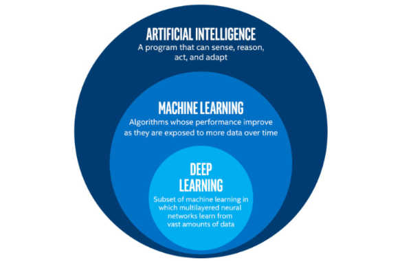
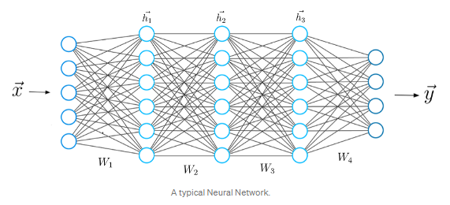
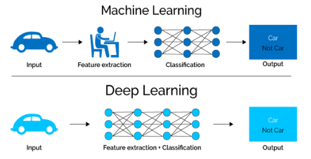
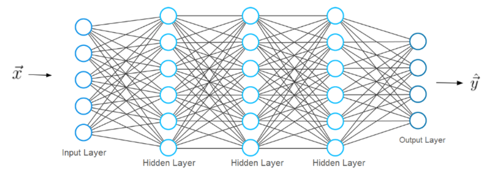
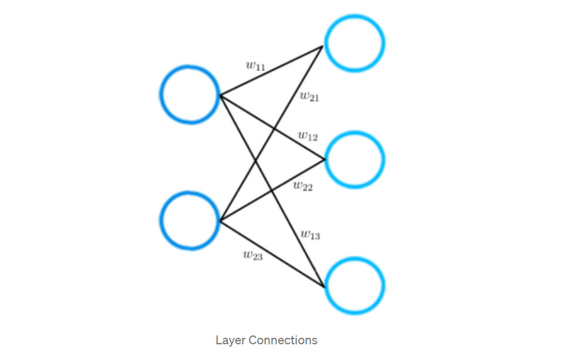

# Apa sebenarnya Deep Learning itu

Deep Learning adalah bagian dari Machine Learning, yang di sisi lain adalah bagian dari Artificial Intelligence. Kecerdasan Buatan adalah istilah umum yang mengacu pada teknik yang memungkinkan komputer untuk meniru perilaku manusia. Pembelajaran Mesin mewakili serangkaian algoritme yang dilatih pada data yang memungkinkan semua ini terjadi.

Deep Learning, di sisi lain, hanyalah jenis Pembelajaran Mesin, yang terinspirasi oleh struktur otak manusia. Algoritma pembelajaran mendalam mencoba untuk menarik kesimpulan yang sama seperti yang dilakukan manusia dengan terus menganalisis data dengan struktur logis yang diberikan. Untuk mencapai hal ini, pembelajaran mendalam menggunakan struktur algoritma berlapis-lapis yang disebut jaringan saraf.

Desain jaringan saraf didasarkan pada struktur otak manusia. Sama seperti kita menggunakan otak kita untuk mengidentifikasi pola dan mengklasifikasikan berbagai jenis informasi, jaringan saraf dapat diajarkan untuk melakukan tugas yang sama pada data.

Lapisan individu jaringan saraf juga dapat dianggap sebagai semacam filter yang bekerja dari kasar ke halus, meningkatkan kemungkinan mendeteksi dan mengeluarkan hasil yang benar.

Otak manusia bekerja dengan cara yang sama. Setiap kali kita menerima informasi baru, otak mencoba membandingkannya dengan objek yang diketahui. Konsep yang sama juga digunakan oleh jaringan saraf dalam.

Jaringan saraf tiruan memiliki kemampuan unik yang memungkinkan model pembelajaran mendalam untuk menyelesaikan tugas-tugas yang tidak dapat diselesaikan oleh model pembelajaran mesin.

Semua kemajuan terbaru dalam kecerdasan buatan dalam beberapa tahun terakhir adalah karena pembelajaran yang mendalam. Tanpa pembelajaran yang mendalam, kita tidak akan memiliki mobil self-driving, chatbots, atau asisten pribadi seperti Alexa dan Siri. Aplikasi Google Terjemahan akan terus menjadi primitif seperti 10 tahun yang lalu (sebelum Google beralih ke jaringan saraf untuk Aplikasi ini), dan Netflix atau Youtube tidak akan tahu film atau serial TV mana yang kita suka atau tidak suka. Di balik semua teknologi ini adalah jaringan saraf.

# Mengapa Deep Learning Populer Saat Ini?

Mengapa pembelajaran mendalam dan jaringan saraf tiruan begitu kuat dan unik di industri saat ini? Dan yang terpenting, mengapa model pembelajaran yang mendalam lebih kuat daripada model pembelajaran mesin?

Keuntungan pertama pembelajaran mendalam dibandingkan pembelajaran mesin adalah tidak perlunya apa yang disebut ekstraksi fitur.

Jauh sebelum pembelajaran mendalam digunakan, metode pembelajaran mesin tradisional terutama digunakan. Seperti Pohon Keputusan, SVM, Pengklasifikasi Naïve Bayes dan Regresi Logistik.

Algoritma ini juga disebut algoritma datar. Datar di sini berarti bahwa algoritma ini biasanya tidak dapat diterapkan langsung ke data mentah (seperti .csv, gambar, teks, dll.). Kita membutuhkan langkah preprocessing yang disebut Feature Extraction.

Ekstraksi Fitur biasanya cukup kompleks dan membutuhkan pengetahuan rinci tentang domain masalah. Lapisan prapemrosesan ini harus diadaptasi, diuji, dan disempurnakan selama beberapa iterasi untuk hasil yang optimal.

Di sisi lain adalah jaringan saraf tiruan Deep Learning. Ini tidak memerlukan langkah Ekstraksi Fitur.

Dengan kata lain, kita juga dapat mengatakan bahwa langkah ekstraksi ciri sudah merupakan bagian dari proses yang berlangsung dalam jaringan syaraf tiruan.

Mari kita lihat contoh konkretnya. Misalnya, jika Anda ingin menggunakan model pembelajaran mesin untuk menentukan apakah gambar tertentu menunjukkan mobil atau tidak, kita manusia harus terlebih dahulu mengidentifikasi fitur atau fitur unik dari mobil (bentuk, ukuran, jendela, roda, dll. ) ekstrak fitur dan berikan ke algoritme sebagai data input.

Dengan cara ini, algoritma akan melakukan klasifikasi gambar. Artinya, dalam pembelajaran mesin, seorang programmer harus campur tangan langsung dalam tindakan model untuk sampai pada suatu kesimpulan.

Dalam kasus model pembelajaran yang mendalam, langkah ekstraksi fitur sama sekali tidak diperlukan. Model akan mengenali karakteristik unik sebuah mobil dan membuat prediksi yang benar.

Itu sama sekali tanpa bantuan manusia. Berikan saja data mentah ke jaringan saraf, sisanya dilakukan oleh model.

**Era Data Besar**

Keuntungan besar kedua dari Deep Learning dan bagian penting dalam memahami mengapa itu menjadi sangat populer adalah bahwa itu didukung oleh sejumlah besar data. Teknologi “Era Big Data” akan memberikan sejumlah besar peluang untuk inovasi baru dalam pembelajaran mendalam.

Model Deep Learning cenderung meningkatkan akurasinya dengan meningkatnya jumlah data pelatihan, di mana model pembelajaran mesin tradisional seperti SVM dan pengklasifikasi Naive Bayes berhenti meningkat setelah saturation point.

# Artificial Neural Network

Jaringan saraf umumnya terdiri dari kumpulan unit atau node yang terhubung. Kami menyebut node ini neuron. Neuron buatan ini secara longgar memodelkan neuron biologis otak kita.

Neuron hanyalah representasi grafis dari nilai numerik (misalnya 1.2, 5.0, 42.0, 0.25, dll.). Hubungan apa pun antara dua neuron buatan dapat dianggap sebagai akson dalam otak biologis nyata.

Hubungan antara neuron diwujudkan dengan apa yang disebut bobot, yang juga tidak lebih dari nilai numerik.

# Neural Network Architecture

Arsitektur jaringan saraf terdiri dari beberapa lapisan. Kami menyebut lapisan pertama sebagai lapisan input. 

Lapisan input menerima input x, data dari mana jaringan saraf belajar. Dalam contoh klasifikasi angka tulisan tangan sebelumnya, input x ini akan mewakili gambar angka-angka ini (x pada dasarnya adalah seluruh vektor di mana setiap entri adalah piksel).

Lapisan terakhir disebut output layer, yang mengeluarkan vektor y yang mewakili hasil yang dihasilkan oleh jaringan saraf. Entri dalam vektor ini mewakili nilai-nilai neuron di lapisan output. Dalam kasus klasifikasi kami, setiap neuron di lapisan terakhir akan mewakili kelas yang berbeda.

Untuk mendapatkan vektor prediksi y, jaringan harus melakukan operasi matematika tertentu. Operasi ini dilakukan di lapisan antara lapisan input dan output. Kami menyebut lapisan ini hidden layer.

# Koneksi Lapisan dalam Jaringan Saraf

Contoh yang lebih kecil dari jaringan saraf yang hanya terdiri dari dua lapisan. Lapisan input memiliki dua neuron input, sedangkan lapisan output terdiri dari tiga neuron.

Seperti disebutkan sebelumnya: setiap koneksi antara dua neuron diwakili oleh nilai numerik, yang kita sebut bobot.

Seperti yang Anda lihat pada gambar, setiap koneksi antara dua neuron diwakili oleh bobot yang berbeda w. Masing-masing bobot ini memiliki indeks.

Semua bobot antara dua lapisan jaringan saraf dapat diwakili oleh matriks yang disebut matriks bobot.