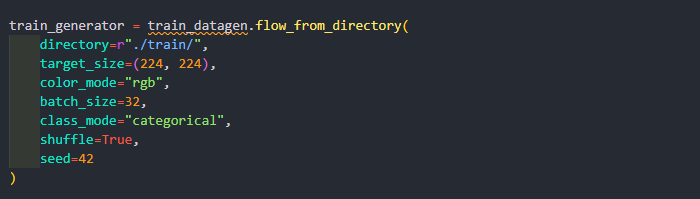

## Image Data Generator

Kelas ImageDataGenerator memiliki tiga metode flow(), flow_from_directory() dan flow_from_dataframe() untuk membaca gambar dari array numpy besar dan folder yang berisi gambar.

Berikut adalah atribut yang paling sering digunakan bersama dengan method flow_from_directory():

**Penjelasan Method:**

1. Direktori harus diatur ke path dimana database train/test/val kita berada.
2. Target_size berfungsi untuk resize ukuran gambar asli, jadi jika gambar asli (256, 256) akan di resize menjadi (224, 224).
3. color_mode: jika gambar hitam putih atau skala abu-abu setel "grayscale" atau jika gambar memiliki tiga saluran warna, setel "rgb".
4. batch_size: Jumlah gambar yang akan ditrain per batch.
5. class_mode: Setel "binary" jika hanya memiliki dua kelas untuk diprediksi, jika tidak disetel ke "categorical", jika  mengembangkan sistem Autoencoder, input dan output mungkin akan menjadi gambar yang sama, untuk set kasus ini untuk "input".
6. shuffle: Atur True jika ingin mengacak urutan gambar yang sedang dihasilkan, jika tidak, atur False.
7. seed: Benih acak untuk menerapkan pembesaran gambar acak dan mengacak urutan gambar.