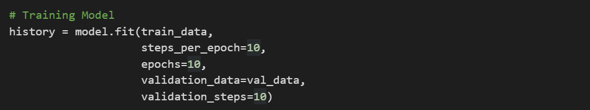

## Model Fit / Train Model

- train_data merupakan variabel yang berisi dataset train sebelum nya.
- steps_per_epoch merupakan jumlah berapa kali putaran atau iterasi sampai seluruh dataset telah dilihat oleh model.
Cara menghitung nya: jumlah dataset train / batch_size = epoch. 1050 / 105 = 10 step_per_epoch, jadi dengan 10 kali putaran atau iterasi maka seluruh dataset telah di train oleh model atau setara dengan 1 epochs.
- validation_data = val_data merupakan variabel yang berisi dataset validasi sebelum nya.
- validation_steps sama dengan steps_per_epoch tapi yang dihitung data validasi.