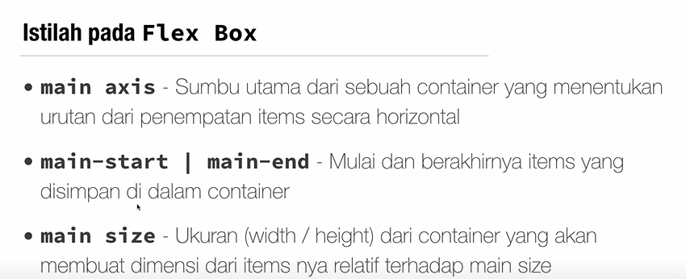
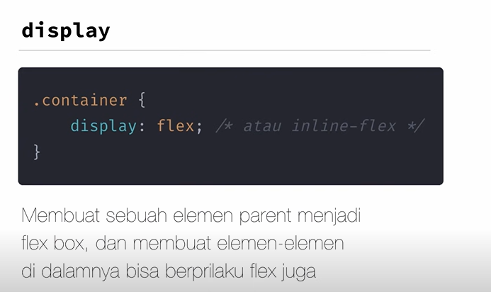
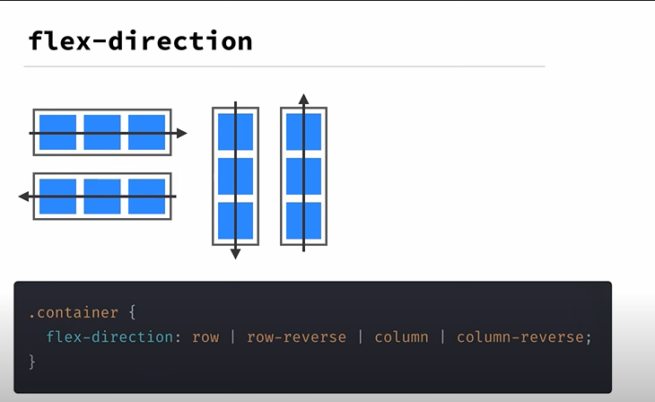
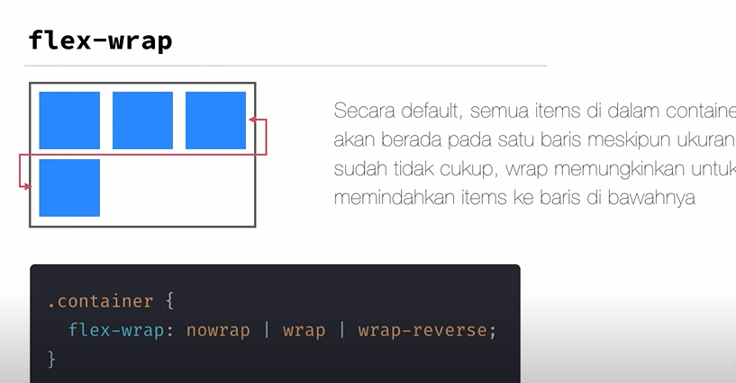
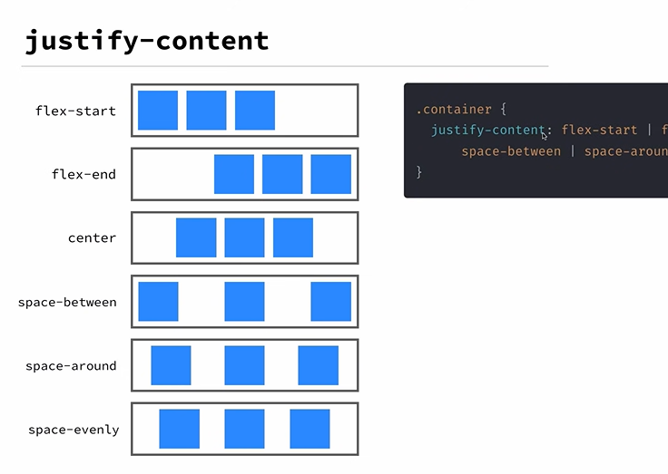
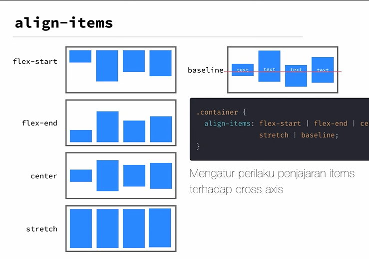
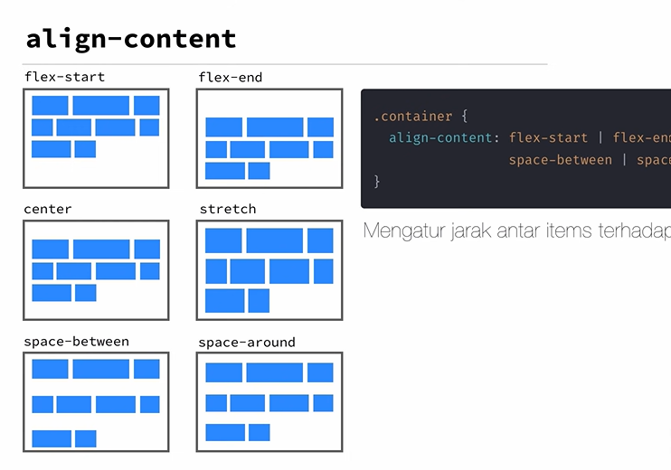
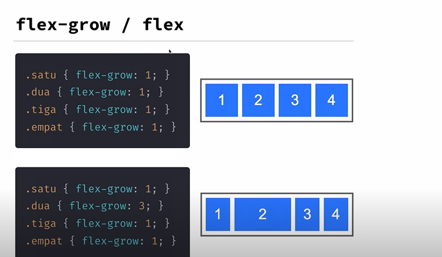
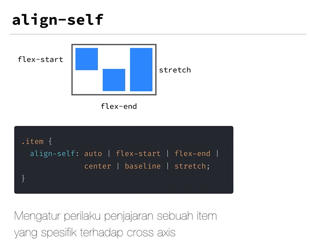

## Flexbox
Model layout 1 dimensi yang dapat mengatur jarak dan penjajaran antar item dalam sebuah container. Satu dimensi berarti, hanya dapat mengatur antara baris atau kolom pada saat tertentu, tidak bisa kedua nya sekaligus.

## Property Flexbox

