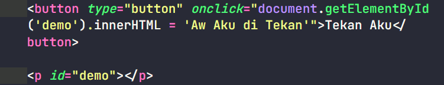
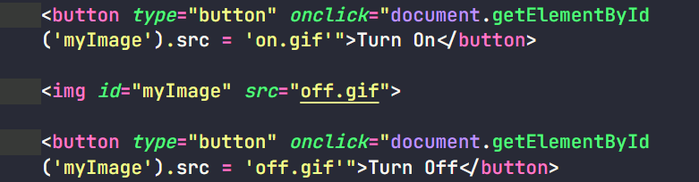
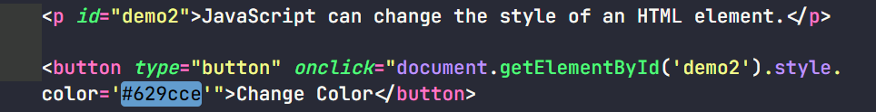
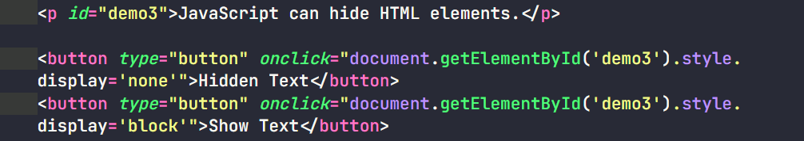

## Contoh apa saja yang dapat dilakukan JavaScript

### JavaScript bisa merubah HTML Content:

### JavaScript bisa merubah nilai atribut pada HTML, contoh merubah nilai dari src atau tag img:

### Javascript bisa merubah style css pada elemen HTML:

### Javascript bisa menghilangkan dan menampilkan elemen HTML:

