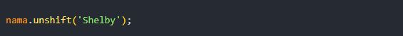

## Array

Array adalah variabel khusus, yang dapat menampung lebih dari satu nilai.

**3 cara membuat array:**

**Nilai array dapat di panggil sesuai nomor indeks:**

**Mengubah nilai array:**

**Memanggil semua nilai array:**

## Array Methods

**Length:** mengembalikan jumlah elemen array

**Push:** Menambah nilai array di akhir

**Pop:** Menghapus satu nilai array di akhir

**Unshift:** Menambah nilai array di awal

**Shift:** Menghapus satu nilai array di awal

**Concate:** Membuat array baru dengan menggabungkan array yang sudah ada

**Sort:** Mengurutkan nilai array sesuai abjad

**toString:** Convert nilai array menjadi string

