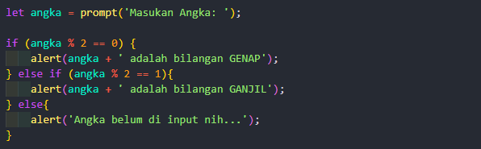
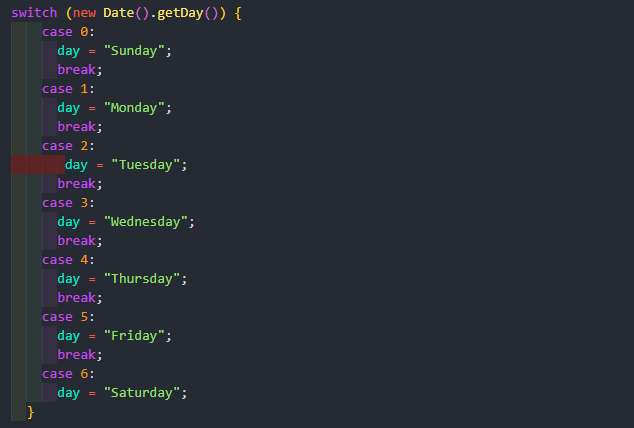

## IF Condition

Pernyataan bersyarat digunakan untuk melakukan tindakan yang berbeda berdasarkan kondisi yang berbeda.

Dalam JavaScript kami memiliki pernyataan kondisional berikut:

1. Gunakan if untuk menentukan blok kode yang akan dieksekusi, jika kondisi yang ditentukan benar
2. Gunakan else untuk menentukan blok kode yang akan dieksekusi, jika kondisi yang sama salah
3. Gunakan else if untuk menentukan kondisi baru yang akan diuji, jika kondisi pertama salah

## Switch Case Condition

Pernyataan switch digunakan untuk melakukan tindakan yang berbeda berdasarkan kondisi yang berbeda.

**Cara kerjanya:**
1. Ekspresi switch dievaluasi sekali.
2. Nilai ekspresi dibandingkan dengan nilai setiap kasus.
3. Jika ada kecocokan, blok kode yang terkait akan dieksekusi.
4. Jika tidak ada kecocokan, blok kode default dijalankan.

**Contoh:**

Metode getDay() mengembalikan hari kerja sebagai angka antara 0 dan 6.

(Minggu=0, Senin=1, Selasa=2 ..)

Contoh ini menggunakan nomor hari kerja untuk menghitung nama hari kerja:

