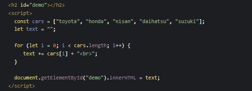
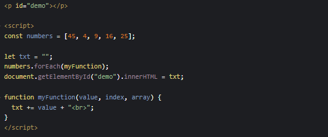
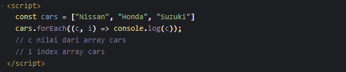
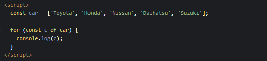
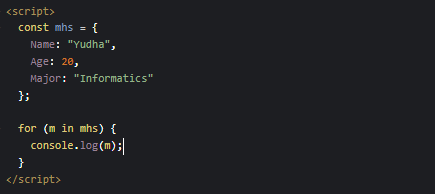
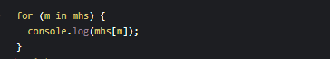

## Looping Nilai Array

Untuk melooping nilai dari array ada 3 cara:
- for
- for.each
- for of

**NOTED:** Tidak ada yang lebih bagus dari ketiga nya, hanya prefer pake yang mana.

## For

For berguna, jika Anda ingin menjalankan kode yang sama berulang-ulang atau looping, setiap kali dengan nilai yang berbeda.

## Array.forEach()

Metode forEach() Bisa memanggil value array nya maupun urutan index. Tinggal masukin di parameter myFunction nya.

Simple: forEach()

**NOTED:** forEach hanya bisa digunakan untuk memanggil nilai array.

## For Of

JavaScript for of loop, memungkinkan kita mengulang struktur data yang dapat diubah seperti Array, Strings, Maps, Arguments / NodeLists.

## For In

For in untuk melooping property dari object:

For in untuk memanggil nilai dari property:

**NOTES:** For in bisa juga di gunakan untuk array tapi tidak disarankan, karena urutan index akan acak, lebih baik menggunakan for, for of, atau Array.forEach() bila urutannya penting.

