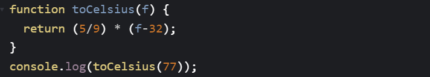
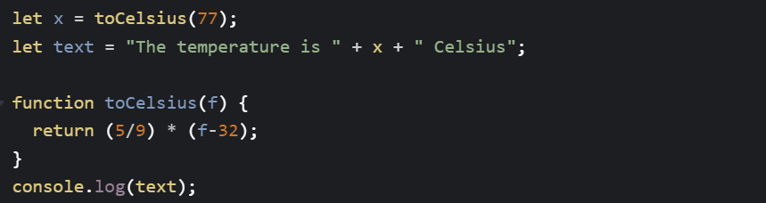
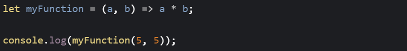
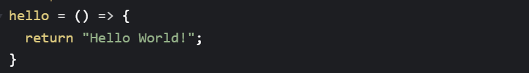
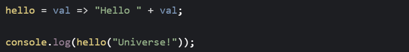
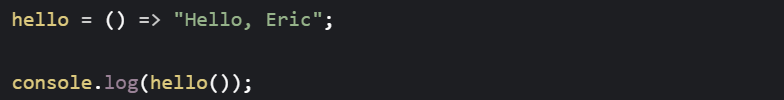
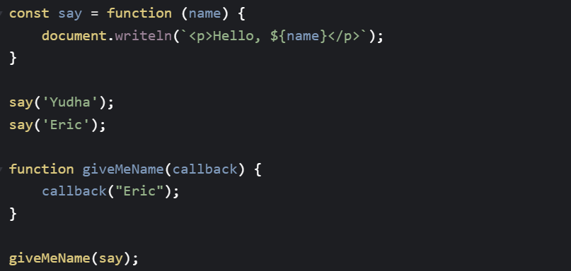

# Function

Fungsi adalah blok kode yang dirancang untuk melakukan tugas tertentu. Fungsi dijalankan ketika "sesuatu" memanggilnya.

- Parameter fungsi tercantum di dalam tanda kurung () dalam definisi fungsi.

- Argumen fungsi adalah nilai yang diterima oleh fungsi saat dipanggil.

- Di dalam fungsi, argumen (parameter) berperilaku sebagai variabel lokal.

# Mengapa Fungsi?

Kita dapat menggunakan kembali (Reuse) kode: Tentukan kode sekali, dan gunakan berkali-kali. Dapat menggunakan kode yang sama berkali-kali dengan argumen yang berbeda, untuk menghasilkan hasil yang berbeda.

# Fungsi dapat Digunakan sebagai Nilai Variabel

Fungsi dapat digunakan dengan cara yang sama seperti Anda menggunakan variabel, dalam semua jenis rumus, penetapan, dan penghitungan.

# Arrow Function

Fungsi panah diperkenalkan di ES6. Fungsi panah memungkinkan kita untuk menulis sintaks fungsi yang lebih pendek:

Jika hanya ada satu parameter, kita juga dapat melewati tanda kurung:

# Anonymous Function

