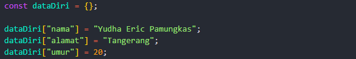
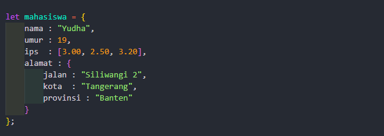
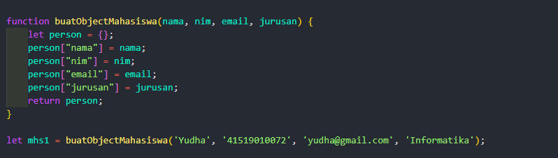
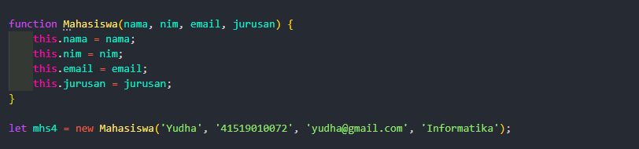

## Object 

Beberapa cara membuat object:

Membuat object kosong, lalu mengisi satu satu

Membuat object dan langsung mengisi data

**Cara memanggil nya:**

1. mahasiswa.nama atau mahasiswa["nama"]
2. mahasiswa.ips[1]
3. mahasiswa.alamat.kota

Membuat object dengan Function Declaration

Membuat object dengan Consturctor, biasanya nama fungsi di awali huruf besar "Mahasiswa" untuk membedakan object constructor dan function declaration

