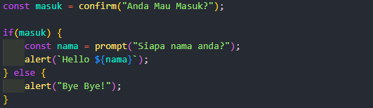

## JavaScript Output

JavaScript bisa "menampilkan" data dengan beberapa cara:

- Menulis di elemen HTML, menggunakan innerHTML.
- Writing into the HTML output menggunakan document.write().
- Menulis di alert box, menggunakan window.alert() atau alert().
- Menulis di browser console, menggunakan console.log().
- Print halaman web, menggunakan window.print().

### Using innerHTML

Untuk mengakses elemen HTML, JavaScript dapat menggunakan metode document.getElementById(id).

Atribut id mendefinisikan elemen HTML. Properti innerHTML mendefinisikan konten HTML:

### Using document.write()

Untuk tujuan pengujian, akan lebih mudah menggunakan document.write(). 

Menggunakan document.write() setelah dokumen HTML dimuat, akan menghapus semua HTML yang ada

Contoh:

Ketika button di klik hanya muncul angka 11

### Using alert()

Kita dapat menggunakan alert box untuk menampilkan data:

### Using Confirm()

Kita dapat membuat input berupa alert sebagai konfirmasi untuk sebelum masuk ke web

### Using console.log()

Untuk tujuan debugging, dapat memanggil metode console.log() di browser untuk menampilkan data.

### Using window.print()

Metode di browser untuk print konten window saat ini.

