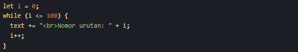
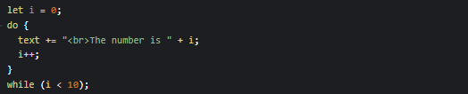

# While Loop

While loop dapat mengeksekusi blok kode selama kondisi yang ditentukan benar.

# Do While Loop

Do While akan mengeksekusi blok kode satu kali, bahkan jika kondisinya salah. Karena blok kode dieksekusi sebelum memeriksa apakah kondisinya benar, kemudian akan mengulangi loop selama kondisinya benar.

