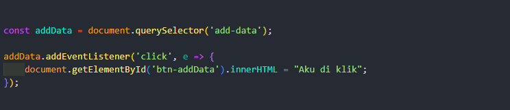

## Dom Event

Berfungsi untuk memberikan effect pada elemen HTML contohnya event click

**Noted:** e merupakan variabel untuk event, jika di panggil console.log(e.target) akan memperlihatkan elemen HTML yang di klik.