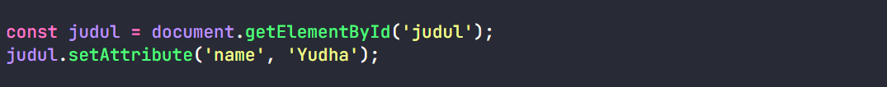
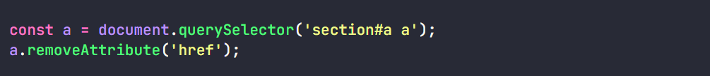

# DOM Manipulation

**setAttribute**: untuk menambahkan atribut pada html.



**NOTED:** kalau menambahkan atribut class dia mengganti class sebelumnya.

**getAttribute:** untuk melihat atribut pada tag html


**removeAttribute:** untuk mengahapus atribut pada html



**classList**

Menambahkan class baru tanpa menimpa class yang lama

```
element.classList.add('') 
```
Menghapus class yang ada

```
element.classList.remove('')
```
Kalo di html sudah ada class label dia akan menghapusnya kalau belum ada dia akan menambahkan nya

```
element.classList.toggle('')
```
Mengetahui class tertentu pada sebuah elemen

```
element.classList.item('')
```
Mengecek pada sebuah elemen ada ngga class tertentu

```
element.classList.contains('') 
```
Mengganti class yang ada dengan class yang baru

```
element.classList.replace('')
```