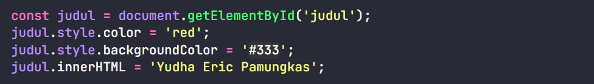
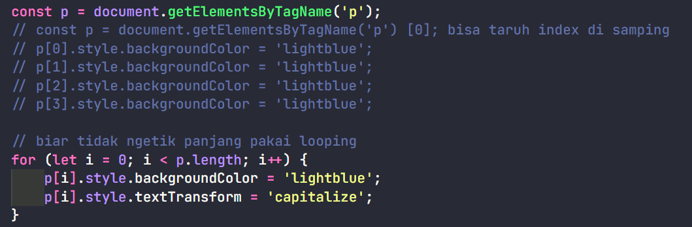
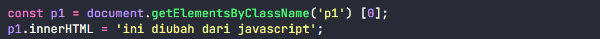

# DOM Selection

### getElementsByID - Element

### getElementsByTagName - HTML Collections

**NOTED:** harus diberi index seperti array

### getElementsByClassName - HTML Collections

**NOTED:** harus diberi index seperti array
