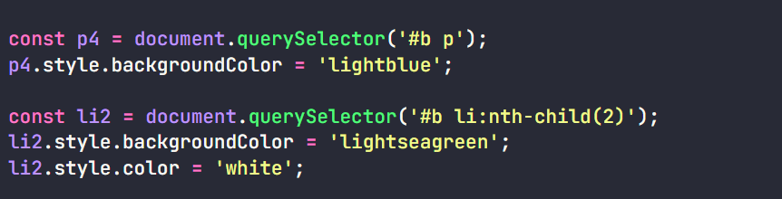
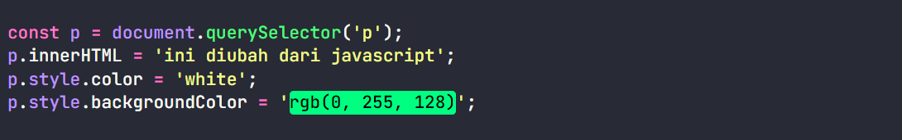
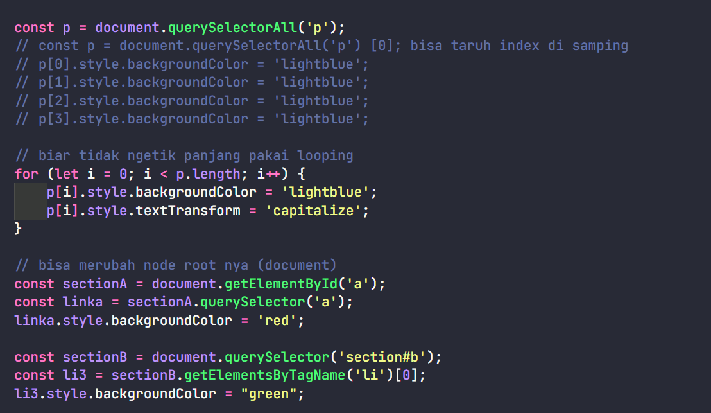

# DOM Selection

### getElementsByID - Element

### getElementsByTagName - HTML Collections

**NOTED:** harus diberi index seperti array

### getElementsByClassName - HTML Collections

**NOTED:** harus diberi index seperti array

# querySelector - Element

**NOTED:** Kalau tag nya banyak seperti p yang berubah tag p yang pertama

# querySelectorAll

