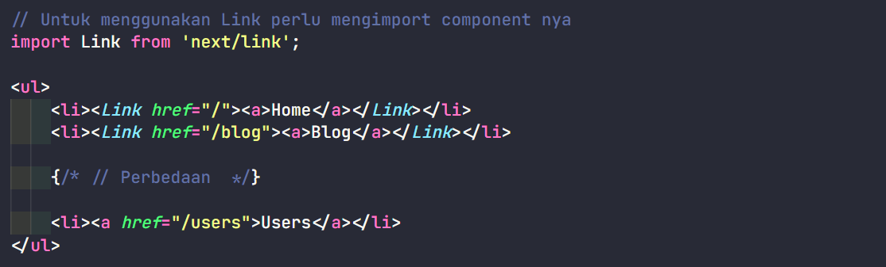

## Components Link

Saat berpindah halaman biasanya menggunakan a (anchor), di NextJs tetap bisa menggunakan a, tetapi jika menggunakan a untuk berpindah halaman akan merefresh page nya.

Pada NextJS sudah di sediakan component khusus untuk berpindah halaman yaitu Link. Dengan menggunakan component Link tidak akan ada proses reload page atau refresh saat berpindah halaman.

