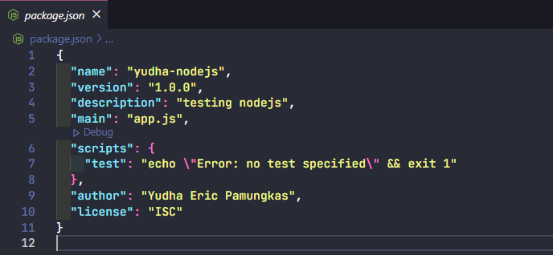
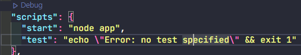

## Package Manager
Package manager merupakan platform yang digunakan untuk memaintenace tools, component, modul dan library dari suatu code. Package manager memungkinkan kita untuk install dan uninstall component yang kita butuhkan.

**Package Manager Javascript:**
- NPM
- Yarn

## Node Package Manager (NPM)
NPM adalah manajer paket untuk Node.js yang membantu pengembang JavaScript dengan mudah berbagi modul kode yang dikemas. NPM Registry adalah kumpulan paket kode sumber terbuka untuk Node.js, aplikasi web front-end, aplikasi seluler, robot, router, dan kebutuhan komunitas JavaScript lainnya yang tak terhitung jumlahnya. NPM adalah klien baris perintah yang memungkinkan pengembang untuk menginstal dan menerbitkan paket-paket itu.

1. Menginisialisasi folder kita sebagai projek NPM

   ```
   npm init
   ```

2. Lalu mengisi data-data yang di butuhkan, setelah itu akan muncul file package.json

   

3. Menjalankan Aplikasi

   ```
   node app.js
   ```

4. Menjalankan aplikasi menggunakan script

   

   ```
   npm start
   ```

5. Install package, setelah install package data-data nya akan masuk ke folder node_modules, dan terbuat file package-lock.json untuk mengelola secara lebih detail dari depedencies projek kita

   ```
   npm install / i validator
   ```
6. Uninstall package
   ```
   npm uninstall validator
   ```
## Package Manager Bahasa Pemrograman Lainnya
**Python**
- Conda
- Pip

**Java**
- Gradle
- Maven

**PHP**
- Composer