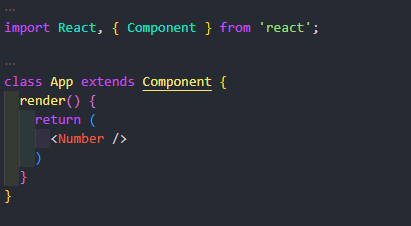
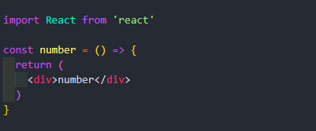

# Component

Component merupakan struktur dasar ketika kita membuat aplikasi dengan react, ada 2 penulisan component yaitu menggunakan class dan function.

Kelebihan dari class component kita bisa mengatur state atau kita bisa mengatur nilai yang dinamis bisa di ubah-ubah. Pada class function tidak bisa mengatur state.

**Class Component:**

**Function Component:**

**Arrow Function Component:**

