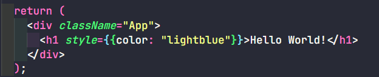
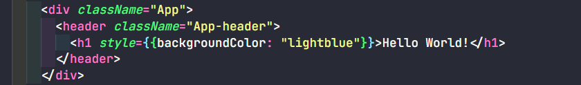
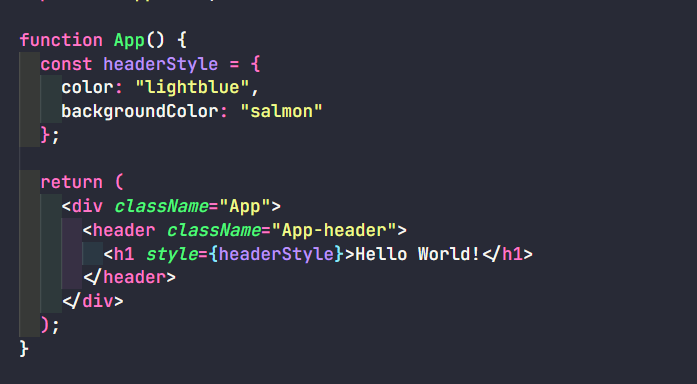
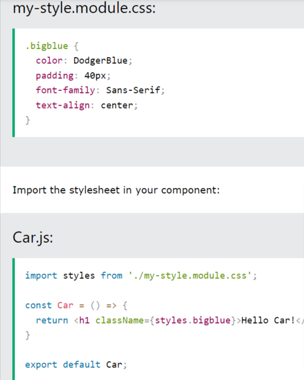

# CSS in React JS

Ada 3 cara menulis CSS pada react:
1. Inline Styling
2. CSS Stylesheets
3. CSS Modules

## Inline Styling



### Camel Case Property Names



### Inline Object Styling



## CSS Stylesheet

Kita dapat menulis gaya CSS dalam file terpisah, cukup simpan file dengan ekstensi file .css, dan import dalam aplikasi.

```
import './App.css';
```

## CSS Module

