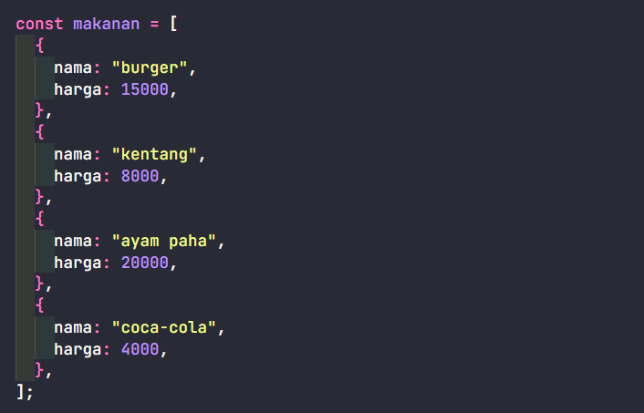
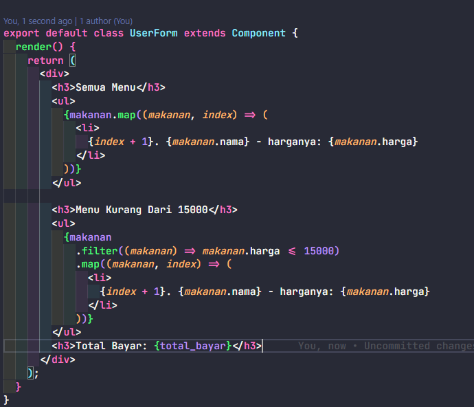
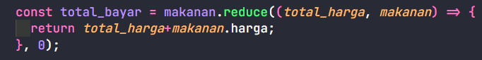

# Looping Nilai Array

Data Array

- Map: Berfungsi untuk melooping nilai array.

- Filter: Berfungsi untuk memfilter nilai yang ingin di looping. Misal looping barang dengan harga < 10000

- Reduce: Berfungsi untuk melihat total data. Misal total harga barang.

