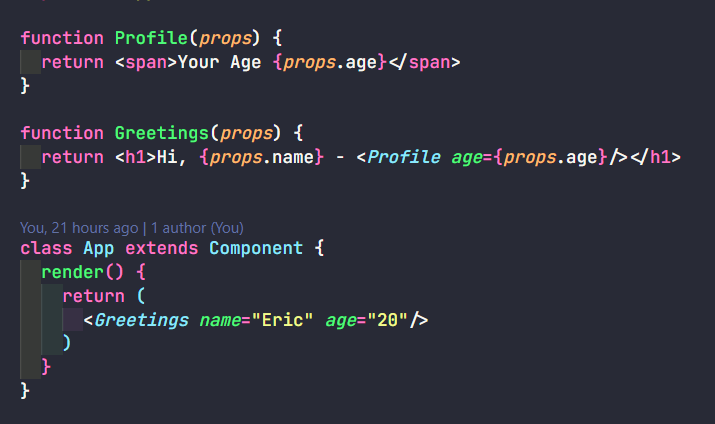
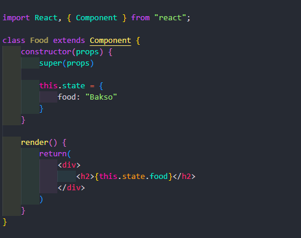

# Properties / Props

Properties merupakan argumen atau nilai yang mau kita pasang agar function nya menjadi dinamis. Props digunakan untuk mengoper nilai di setiap component atau component di dalam component.

# State

State mirip dengan props yaitu untuk mengoper nilai, bedanya state hanya mengoper nilai nya di component itu sendiri. State bisa menjadi props saat dioper ke component lain.
- State hanya bisa digunakan pada class component.
- Constructor adalah fungsi yang otomatis dijalankan.
- Super props untuk ngasih nilai-nilai ke component yang mau kita oper di propertynya nanti.

**State Merubah Text Langsung:**

**State Merubah Text Dengan Function:**

**State Mengoper Nilai / Props:**

