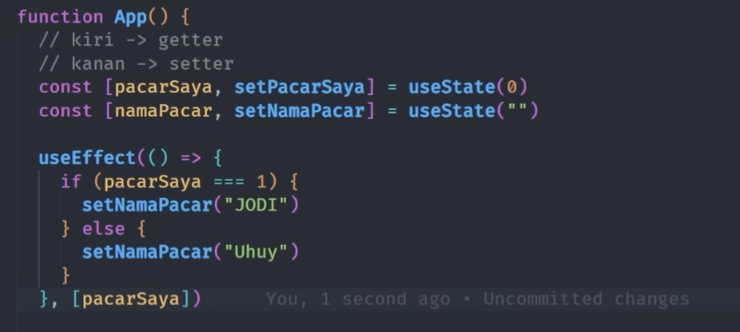

# React JS Hooks - useState useEffect

useState merupakan cara mengoper data/variabel pada function component jadi tidak bisa digunakan pada class component, pada kelas component menggunakan state. Penulisan useState lebih simpel di banding dengan state dan saat ini sering digunakan.

## useState

useState berguna juga untuk penampungan data sementara, yang bisa kita set ulang dengan function yang kita punya. Ada 2 parameter dalam useState atau disebut getter dan setter.


## useEffect
useEffect merupakan function yang dijalankan pertama kali ketika browser dijalankan.



useEffect memiliki 3 tipe:
- Tanpa array berarti setiap ada perubahan pada functional component data pada console.log akan selalu di kirim.
- Array kosong berarti data pada console.log hanya sekali di kirim pada saat pertama kali browser di refresh.
- Dengan array tapi manggil variabel yang ada

```
useEffect (() => {
    console.log("Hai")
})

useEffect (() => {
    console.log("Hai")
},[])

useEffect (() => {
    console.log("Hai")
},[gretings])
```