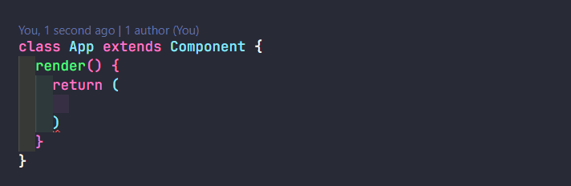
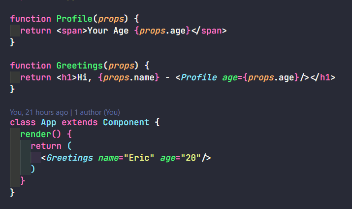
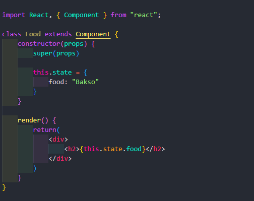
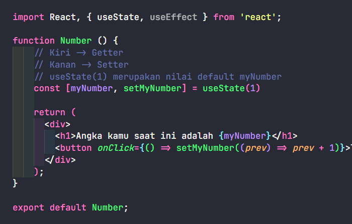

## Component

Component merupakan struktur dasar ketika kita membuat aplikasi dengan react, ada 2 penulisan component yaitu menggunakan class dan function.

Kelebihan dari class component kita bisa mengatur state atau kita bisa mengatur nilai yang dinamis bisa di ubah-ubah. Pada class function tidak bisa mengatur state.



## Properties / Props

Properties merupakan argumen atau nilai yang mau kita pasang agar function nya menjadi dinamis. Props digunakan untuk mengoper nilai di setiap component atau component di dalam component.



## State

State mirip dengan props yaitu untuk mengoper nilai, bedanya state hanya mengoper nilai nya di component itu sendiri.

Constructor adalah fungsi yang otomatis dijalankan.

Super props untuk ngasih nilai-nilai ke component yang mau kita oper di propertynya nanti



# React JS Hooks - useState useEffect

## useState

useState berguna juga untuk penampungan data sementara, yang bisa kita set ulang dengan function yang kita punya. Ada 2 parameter dalam useState atau disebut getter dan setter.



## useEffect
useEffect merupakan function yang dijalankan pertama kali ketika browser dijalankan.


useEffect memiliki 3 tipe:
- Tanpa array berarti setiap ada perubahan pada functional component data pada console.log akan selalu di kirim.
- Array kosong berarti data pada console.log hanya sekali di kirim pada saat pertama kali browser di refresh.
- Dengan array tapi manggil variabel yang ada

```
useEffect (() => {
    console.log("Hai")
})

useEffect (() => {
    console.log("Hai")
},[])

useEffect (() => {
    console.log("Hai")
},[gretings])
```