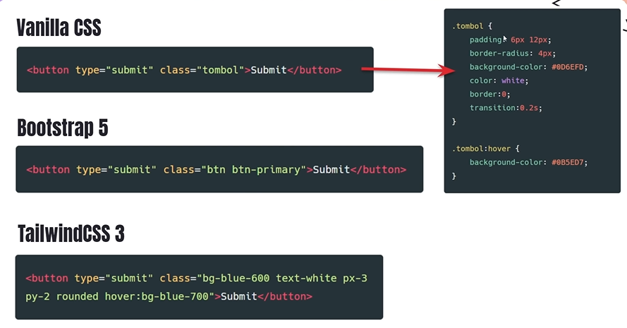

## Bootstrap VS Tailwind

Bootstrap tidak hanya memiliki utility tetapi juga mempunyai component, makanya Bootstrap disebut UI Framework karena didalam nya banyak component-component siap pakai. Sedangkan Tailwind hanya memiliki utility, jadi kita bikin component nya dari awal dan menambahkan class class utility nya.

## Perbedaan

