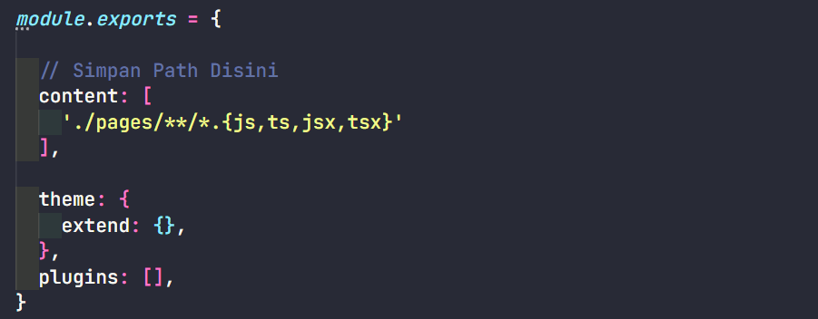

## Install Tailwind CSS

```
npm init
```

```
npm install tailwindcss
```

Untuk membuat file konfigurasi tailwind.config.js

```
npx tailwindcss init
```

## Konfigurasi Template Path

Konfigurasi file Javascript yang ingin diberikan class - class Tailwind dengan nya ke dalam content.



**NOTED:** 

- ./ = root file nya atau folder utama 
- src = difolder apa nanti kita simpan
- ** = akan cek atau melihat seluruh folder yang ada didalam nya 
- *.{js,ts,jsx,tsx} = akan cek semua file apapun di dalam nya, selama dia ektensi file nya js, ts, jsx, tsx
- theme akan merubah sebuah default value, apabila hanya custom satu value sisanya akan hilang, extend hanya mereplace satu value yang di custom

## Tailwind Directives

Sebelum Tailwind dijalankan, dia akan melewati file CSS yang ada 3 baris ini atau disebut 3 Layer of Tailwind. Kita perlu membuat file CSS sendiri. 

```
@tailwind base;
@tailwind components;
@tailwind utilities;
```

Penjelasan:

- Base: Dia akan mereset semua style yang diberikan oleh browser, agar kendali penuh ada di kita.
- Components: Dia akan meminta component didalam library nya, seperti container, grid system.
- Utilities: Dia akan memanggil class - class utilities yang akan kita pakai.

## Menjalankan proses build nya 

Membuat file CSS akhir yang digunakan oleh web kita, jadi yang akan digunakan oleh web kita bukan file CSS yang berisi 3 Layer of Tailwind.

```
npx tailwindcss -i ./input.css -o ./output.css --watch
```

Penjelasan:

- -i: input
- -o: output
- --watch: supaya tiap perubahan diketahui oleh Tailwind sehingga apapun yang kita lakukan di HTML kita akan langsung dilakukan proses perubahan.

Setelah di jalankan akan membuat file output.css, kalau kita buka akan berisi CSS yang banyak, hasil dari Tailwind mengcompile isi dari input.css menjadi output.css dan output inilah yang akan dipakai oleh web kita. 

## Minify

Setelah proses development selesai kita bisa mengurangi ukuran file CSS atau minify, agar lebih cepat di akses:

```
npx tailwindcss -o ./public/css/final.css --minify
```

