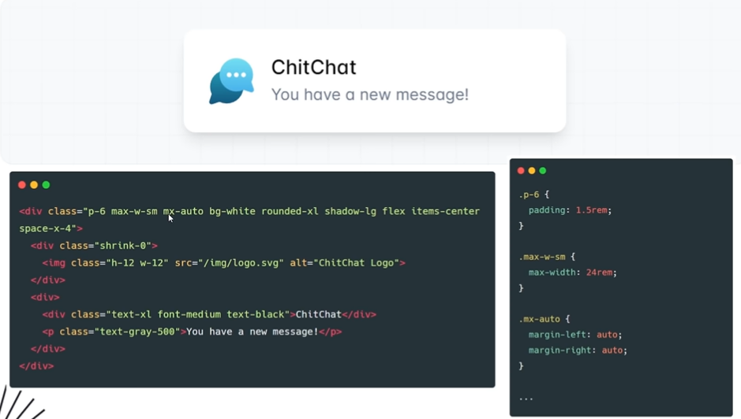
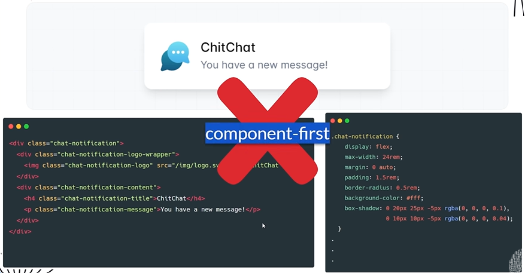

## Apa itu Tailwind

Sebuah Utility-first framework yang di dalam nya terdapat banyak sekali class-class. Sebuah framework yang dapat membuat kita dengan cepat membangun website yang modern, jadi semua nya dapat kita buat tanpa meninggalkan file HTML.

## Apa itu Utility-first

Dengan menggunakan Tailwind di dalam element HTML nya akan memiliki class untuk memangil style nya, dimana class class nya sudah di definisikan dalam file CSS oleh Tailwind. Jadi kita cukup panggil class class nya saja. Semua class nya di sebut class utility, jadi satu class hanya untuk melakukan satu hal saja atau disebut Utility-first, tidak ada satu class yang di dalam nya banyak style CSS.

## Apa itu Component-first

Dengan menggunakan CSS terpisah disebut Component-first. Jadi element HTML nya di anggap component, lalu kita kasih style untuk component tersebut. Satu component memiliki banyak style.

