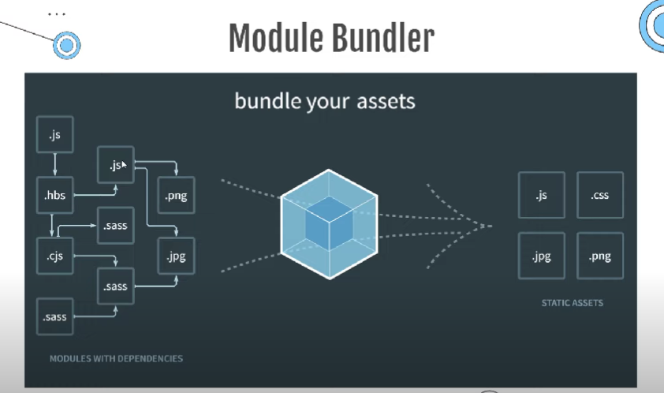

## Module Bundler
Module bundler merupakan sebuah tool yang mengambil code javascript yang kita gunakan (beserta dengan dependency-nya) dan mem-bundel / menggabungkan menjadi satu buah file (biasanya untuk digunakan di browser).

**Benefit:**

- Melakukan penggabungan dan pengelolaan dependencies secara otomatis dan tidak peduli seberapa banyak file yang di bundle.
- Script yang sudah di bundle bisa dibuat lebih kecil ukuran file nya, dengan teknik minify / uglify.



**Macam-macam module bundler:**

- webpack
- rollupjs
- parceljs
- vitejs

## Webpack

Webpack merupakan salah satu dari software tooling yang yang disebut dengan module bundler.

**Basic:**

1. Install Webpack

    ```
    npm install webpack webpack-cli --save-dev
    ```

2. Run Webpack

    ```
    npm run build
    ```

3. Otomatis membuat folder dist yang berisi file main.js, isi file nya adalah hasil bundling atau hasil pembuatan dari webpack. File ini lah yang akan dimasukan ke file HTML kita.